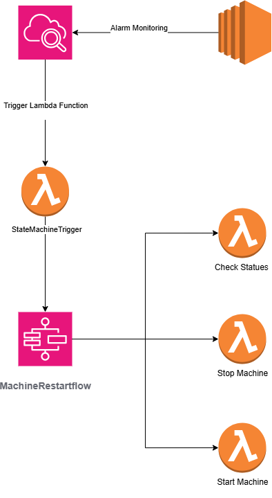

# EC2 Automation with Lambda and Step Functions

## Project Overview
This project automates the restart of EC2 instances when CPU utilization exceeds 80% for 5 minutes, using AWS Lambda, Step Functions, and CloudWatch. It showcases event-driven automation and orchestration.

**Note**:
- I already know that this can be simplified using AWS Cloudwatch Ec2 Restart trigger but i am going in depth of each service so i can understand it read about it and gain it's knowledge so i can use them in future projects

## Architecture Diagram
- Diagram: 

## Setup Instructions
1. **IAM Role**:
   - Create a role (e.g., `ec2-automation-role`) with permissions for EC2 (`ec2AcessInstances`, `StateMachineTrigger`) and CloudWatch Logs.

2. **Lambda Functions**:
   - **StepMachineTrigger**: [StateMachineTrigger.py](./Sources/StateMachineTrigger.py )
   - **StopEC2Instances**: [stop_ec2.py](./Sources/stop_ec2.py)
   - **StartEC2Instances**: [start_ec2.py](./Sources/start_ec2.py)
   - **CheckEC2Instances**: [check_ec2.py](./Sources/check_ec2.py)
   - Runtime: Python 3.9
   - Attach the IAM role created above.

3. **Step Function**:
   - Create a state machine named `EC2RestartStateMachine`.
   - Definition: [step_function.json](./Sources/step_function.json)
   - Replace `<ARN>` placeholders with the actual Lambda ARNs.

4. **CloudWatch Alarm**:
   - Metric: CPUUtilization > 80% for 5 minutes.
   - Action: Trigger the Step Function via SNS or direct integration to lambda that triggers the Step Function.

5. **Test the Automation**:
   - Simulated high CPU usage using stress --cpu 8 on the EC2 instance.
   - Confirmed the CloudWatch alarm triggered the Step Function.
   - Verified the instance stopped and restarted via EC2 console and Step Function execution logs.

## Lessons Learned
   - Learned to orchestrate Lambda functions with Step Functions for complex workflows.
   - Improved error handling by dynamically passing instance_id through the event payload.
   - Understood the importance of IAM permissions for automation tasks.

## Things i sturggled with
   - so this was the first time learning about the lambda functions and how they interact with the services so i got the basics then i got to work with it
   - one thing i sturggled with is to find out how i could introduce all this work but stay within the free tier
   - the Step function saved lots of work and drops the cost of lambda functions and keeps them within the best practice (e.g: keeping the function for a specific task)