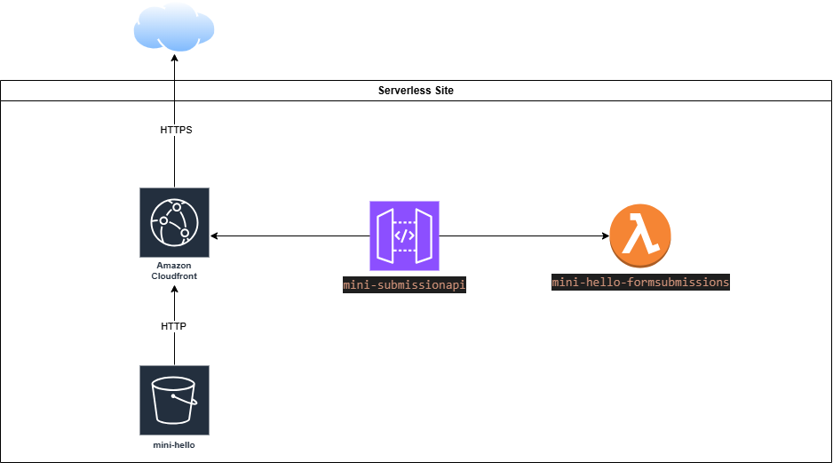

# Serverless Portfolio Site

## Project Overview
This project demonstrates how to build a serverless portfolio website using AWS services. The site is hosted on S3, secured with HTTPS using CloudFront, and includes a form that submits data to a Lambda function through API Gateway. The Lambda function processes the form data and stores it in an S3 bucket.

## Architecture Diagram
Diagram: 

## Setup Instructions
1. **Create an S3 Bucket**:
   - Name: `mini-hello`
   - Enable static website hosting.
   - Upload `index.html` with the form pointing to the API Gateway endpoint.

2. **Set Up CloudFront**:
   - Create a distribution with the S3 bucket as the origin.
   - Configure SSL/TLS for HTTPS.

3. **Create API Gateway**:
   - Set up a REST API named `mini-submissionapi` with a `POST /submit` method.
   - Enable CORS and integrate with the Lambda function.

4. **Create Lambda Function**:
   - Name: `mini-hello-formsubmissions`
   - Runtime: Python 3.9
   - Code: [lambda_function.py](./lambda_function.py)
   - Attach IAM role `mini-world` with S3 write permissions.
   [Diagram](./Diagram.png).

5. **Testing and Validation**:
   - Access the site via the CloudFront URL (e.g., `https://d1rbt0ac744n52.cloudfront.net`).
   - Submit the form and verify data is stored in S3 under the `messages/` prefix.
   - Verified the JSON file was saved in S3 under messages/ (e.g., 2025-03-31-025322-f79e9c91-6f0b-4090-a6e7-52d8d100e331.json).
   - Checked CloudWatch logs to confirm successful Lambda execution.

## Lessons Learned
   - Mastered serverless integration of S3, CloudFront, Lambda, and API Gateway.
   - Addressed CORS issues for browser compatibility by enabling CORS in API Gateway.
   - Debugged Lambda KeyError by using .get() for safe event parsing.

## Things i sturggled with
   - I overcomplicated the project and dove into AWS ampilify i got the basics there but i understood am taking a shortcut and not understanding the basics so i went back to S3 to get the fundementals first.
   - The Permessions was just messed up i took my time to set everything right making sure everything is using the least privileged access and permessions.
   - Debugging why the lambda function wasn't getting my submssions , in the end i found i was calling the body from the json but it was just getting the name and qoute so i fixed that and added the name and the qoute to the logs instead of the body.